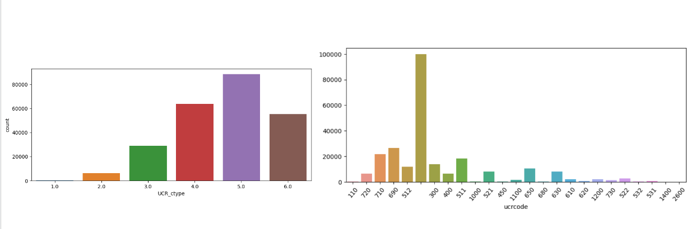
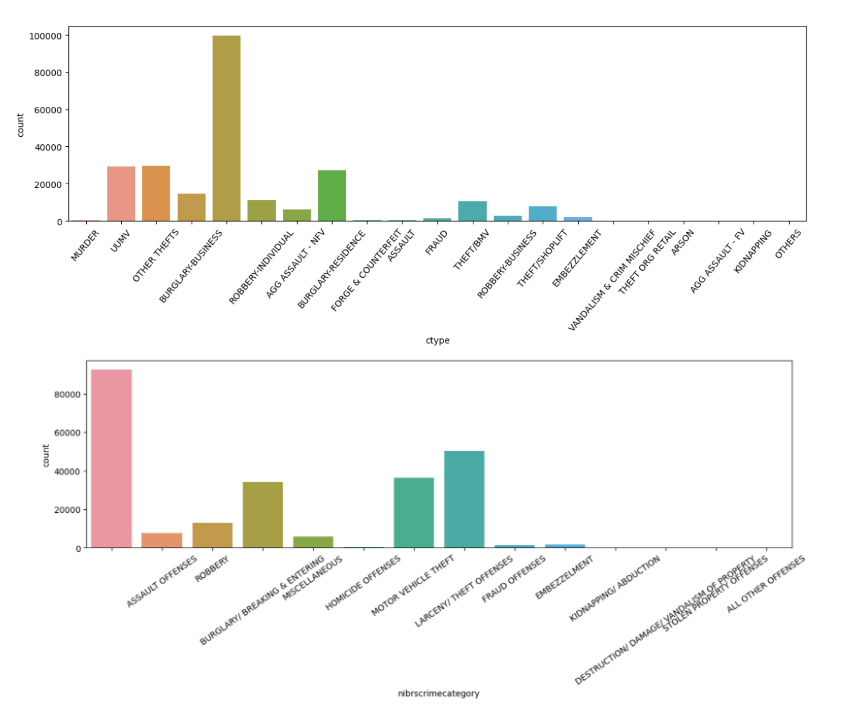
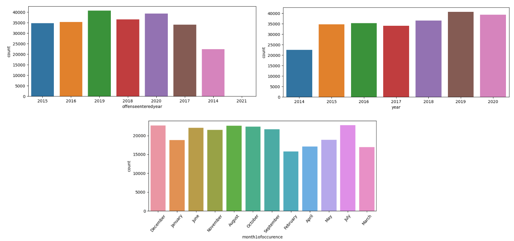
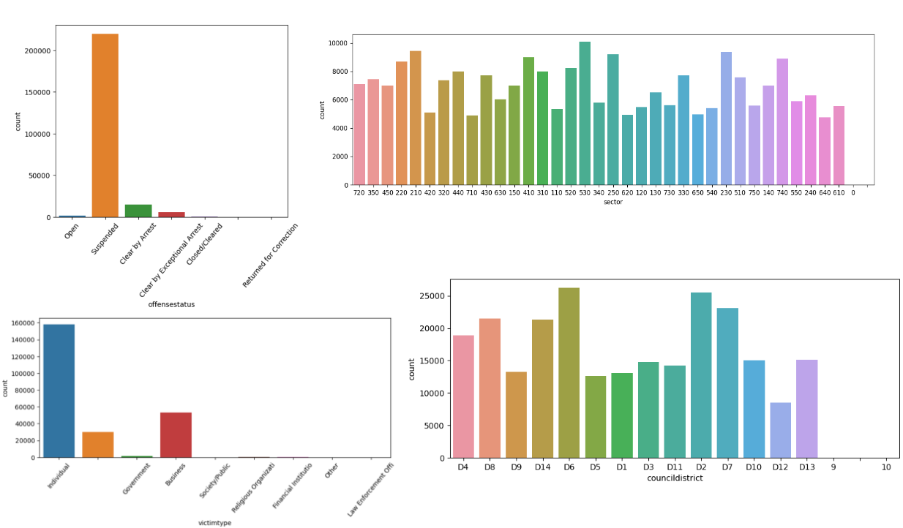
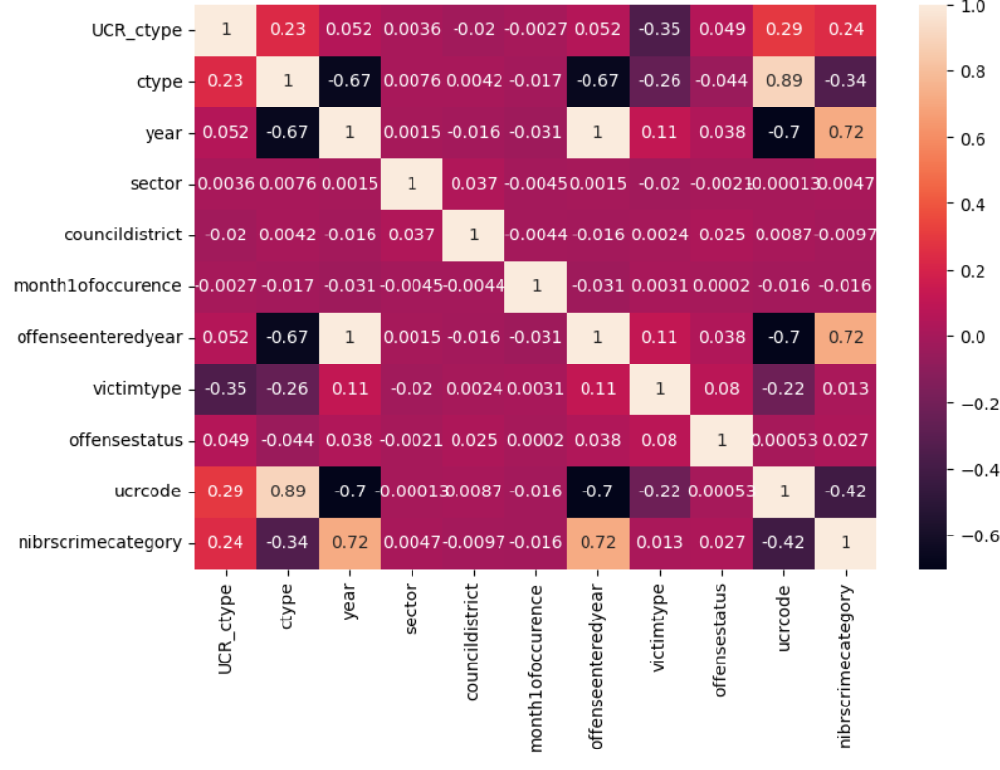

# Exploratory Data Analysis 
### - StudentID: 22220036
### - Name: Silvia Garces
### - 1st Major: Biomedical engineering

<i>As we know there are several crimes that are not solved or end up being suspended, in this case it would be a good idea to predict which crimes are most likely to be solved by their characteristics, or predict the type of crime. </i>

## 1. Data overview  
After looking at the data we checked that it contains 663249 crimes with 107 variables. These variables include important details of the crimes, such as the date it occurred, the type of case, information about the victims, among other ones. In this report we will explain the main variables and research for interesting patterns helping us understand the dataset.

First of all, we had to remove the samples that had missing values, identified as NaN, after removing them we ended up with 243174 samples that we could use to analyze the data. 

The variables are: '**incidentnum**' refers to the number associated with the crime, '**UCR_ctype**' relates to the type of crime in the Uniform Crime Reporting program, '**cnt**' is always 1, '**ctype**' is the type of crime, '**year**' refers to the year of the crime, '**servicenumberid**' is the id refered to the service number, '**watch**' is the number of police patrols, '**call911problem**' is the classification the 911 gave to the case, '**typeofincident**' explains the type of crime, '**typelocation**' refers to the type of place the crime occured, '**typeofproperty**', '**incidentaddress**' is teh address where the crime took place , '**apartmentnumber**' the number of the apartment, '**reportingarea**' is the area where the report occurred, '**beat**' is the designated area assigned to the police officer, **'division'** is the division of the city, **'sector'** corresponds to the sector of the region, **'councildistrict' **corresponds to the number of the district, '**targetareaactiongrids**', '**community**', '**date1ofoccurrence**' it is the date where the crime happened, '**year1ofoccurrence**' year when the crime happened, '**month1ofoccurence**' month when the crime occurred, '**day1oftheweek**' day when the crime occurred, '**time1ofoccurrence**' hour when the crime occured, '**day1oftheyear**' number of the day it occurred, '**date2ofoccurrence**' date when the crime happened again, '**year2ofoccurrence**' year when it happened again, '**month2ofoccurence**' month when it happened again, '**day2oftheweek**' day when it happened again, '**time2ofoccurrence**' hour when it happened again, '**day2oftheyear**' day of year when it happened again, '**dateofreport**' date of when the crime was reported, '**dateincidentcreated**' when the incident was created, '**offenseenteredyear**' year when the indicent was created, '**offenseenteredmonth**' month when the indicent was created, '**offenseentereddayoftheweek**' day when the indicent was created, '**offenseenteredtime**' time when the indicent was created, '**offenseentereddatetime**' day of year when the indicent was created, '**cfsnumber**' refers to the call for service number, '**callreceiveddatetime**' date when the called was received, '**calldatetime**' time when the call started, '**callcleareddatetime**' when the called finished, '**calldispatchdatetime**', '**specialreportprerms**' report of the ocurrence, '**personinvolvementtype**' which type of person was involved in the ocurrence, '**victimtype**' type of victim organization, '**victimname**' name of the victim, '**victimrace**' race of the victim, '**victimethnicity**' ethnicity of the victim, '**victimgender**' gender of the victim, '**victimage**' current age of the victim, '**victimageatoffense**' age of the victim during the crime, '**victimhomeaddress**' address of the victim, '**victimapartment**' number of apartment of the victim, '**victimzipcode**' zip code of victim, '**victimcity**' city where the victim is from, '**victimstate**' state where the victim is from, '**victimbusinessname**' name of business, '**victimbusinessaddress**' address of business, '**victimbusinessphone**' phone number of business, '**respondingofficer1badgeno**' number of the officer who answered the call, '**respondingofficer1name**' name of the officer who answered the call, '**respondingofficer2badgeno**' number of second officer who answered the call, '**respondingofficer2name**' name of the second officer who answered the call, '**reportingofficerbadgeno**' number of officer who reported the case, '**assistingofficerbadgeno**' number of the support officer, '**reviewingofficerbadgeno**' number of the officer reviewing the case, '**elementnumberassigned**' assigned number for the case, '**investigatingunit1**' name of unit investigating the case, '**investigatingunit2**' name of second unit investigating the case, '**offensestatus**' status of the crime, '**ucrdisposition**' uniform crime reporting status, '**victiminjurydescription**' description of the injury, '**victimcondition**' condition of victim, '**modusoperandimo**' mode of operation, '**familyoffense**' if it was a family issue, '**hatecrime**' if it was a hate crime, '**hatecrimedescription**' description of hate crime, '**weaponused**' used weapon, '**gangrelatedoffense**' if the crime is related to gang violence, '**victimpackage**', '**drugrelatedistevencident**' relation of drugs in the incident, '**rmscode**' code of rms, '**criminaljusticeinformationservic**' code of the criminal justice information, '**penalcode**' penal code of the crime, '**ucroffensedescription**' description of crime by UCR, '**ucrcode**' code of UCR, '**offensetype**' type of offense, '**nibrscrime**' type of crime by NIBRS, '**nibrscrimecategory**' category of crime by NIBRS, '**nibrscrimeagainst**' victim type by NIBRS, '**nibrscode**' NIBRS code, '**nibrsgroup**' group of NIBRS, '**nibrstype**' type of NIBRS, '**updatedate**' updated date of crime, '**xcoordinate**' coordinate of X , '**ycordinate**' coordinate of Y, '**zipcode**' zipcode, '**city**' city, '**state**' state, '**location1**' location of crime, '**address**' address of crime, '**geo_lat**' geographical latitude, '**geo_long**' geographical longitude, '**blkidfp00**' and '**blkidfp10**'.

As we can tell there are a lot of variables that may not be useful for the problem detection as they have several unique values. For that, we have selected only the variables with less than 1000 unique values as it will make easier to test the relationship between them,  and variables that have important information for predicting purposes, we will focus mainly on the characteristics of the crime. The variables selected are in the following table, as well as the type of data and their ranges if it applies.

|         Variable         |  Type   |                   Range                   |
| :----------------------: | :-----: | :---------------------------------------: |
|        UCR_ctype         | Numeric |                   [1,6]                   |
|          ctype           | String  |                     -                     |
|           year           | Numeric |                [2014,2020]                |
|          watch           | String  |                  [1,2,3]                  |
|      typeofincident      | String  |                     -                     |
|       typelocation       | String  |                     -                     |
|         division         | String  |                     -                     |
|          sector          | String  |                     -                     |
|     councildistrict      | String  |                     -                     |
|        community         | String  |                     -                     |
|    year1ofoccurrence     | String  |                     -                     |
|    month1ofoccurence     | String  |         ['January' to 'December']         |
|    offenseenteredyear    | String  |            ['2014' to '2021']             |
|        victimtype        | String  |                     -                     |
|     victimethnicity      | String  |                     -                     |
|       victimgender       | String  |                     -                     |
|    victimageatoffense    | String  |                     -                     |
|    investigatingunit1    | String  |                     -                     |
|    investigatingunit2    | String  |                     -                     |
|      offensestatus       | String  |                     -                     |
|      ucrdisposition      | String  |                     -                     |
|        hatecrime         | String  |               ['Yes', 'No']               |
|        weaponused        | String  |                     -                     |
|    gangrelatedoffense    | String  |      ['Yes', 'No', 'UNK', 'G', 'J']       |
| drugrelatedistevencident | String  | ['Yes', 'No', 'UNK', 'Unknown', '2', '3'] |
|  ucroffensedescription   | String  |                     -                     |
|         ucrcode          | String  |                     -                     |
|    nibrscrimecategory    | String  |                     -                     |
|         zipcode          | String  |                     -                     |

After selecting the appropriate variables we are going to analyze them more in detail.

## 2. Univariate analysis  
We have analyzed all the selected variables, but most of them have still a lot of empty values, so by looking at their histograms we'll choose the ones that gives us the best information about the crimes. Out of the 29 variables selected only 11 show important information in the histograms. 

### 2.1 Crime types

The variables related to the crime times and codes used by the police show the following histograms. They are related to the Uniform Crime Reporting program, each type of crime has an specific code and there are several other codes for their identification.

Figure 1. UCR type and UCR code

For the type of crimes we can see that they are mainly burglary and robberies to businesses, but there is a high number of assaults as well.

Figure 2. Type of crime and category by NIBRS.

### 2.2 Variables related to the time of the crimes

There are several variables explaining when the crimes took places, we focused mainly on the year and months. If we check the year variable we can see that the crimes have increased proportionally since 2014, but it seems that they started to decrease in 2020, so it would be possible if in the following years it starts to decrease as well. 

~~

Figure 3. Year and month where the crimes took place 

### 2.3 Other variables related to the crimes

The last variables we analyzed explains the sectors and district of the crimes as well as the victims type. We also plotted the histogram of the status of all the crimes to check how many of them are solved or not.

As we can see in the picture most of the crimes are still unsolved and they are mainly against individual citizens. Talking about the zones of the crimes they are almost evenly distributed but most of them are concentrated in districts number 2, 6 7 and 8.

Figure 4. Crime status and other variables of the crimes.

## 3. Multivariate analysis  

After analyzing the different variables separately we are going to check if there is any correlation between some of them. As we are going to focus on the crimes that are solved or not solved, we will use that variable to check the correlation with others. 

### 3.1 Correlation matrix

 Figure 5. Correlation matrix of all 11 variables analyzed in the univariate analysis.

We can see that the biggest correlation appears between the year and the category of the crime stated by NIBRS, as the correlation is of 0.72 which is really close to 1. Another pattern we can find is the correlation between the ctype (crime type) and URC code given, as the value is 0.89 which is the highest among all correlations.

With this we can tell that depending on the year the type of crimes have been different and in some years there has been an abundance of certain crimes. 

## 4. Suggestion  
After conducting data analysis, we found limited patterns. However, by examining correlations, we can provide alternative insights. Specifically, we observed that certain crime characteristics vary depending on the year, which suggests the possibility of predicting crime types based on features such as the year of the crime, UCR_ctype, or UCR code. To achieve this, we plan to leverage classification algorithms, including neural networks or decision trees.

Additionally, we could explore predicting the likelihood of solving crimes based on their characteristics. This could be especially valuable given the high number of suspended crimes in the dataset, allowing police to prioritize cases that are more likely to be solved and save time.

To further deepen our understanding, we need to collect additional data from other years and ensure that the dataset values are appropriate. Notably, the dataset contains a substantial number of null and empty values, which could impact our analysis.
